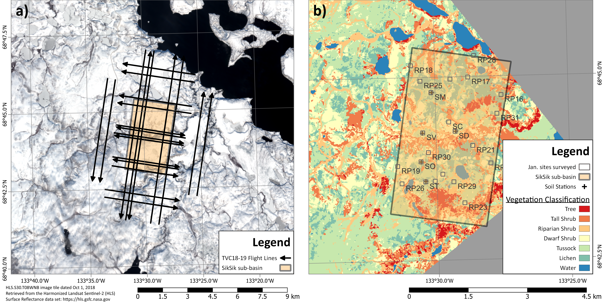

# TVC Experiment 2018/19

This repository contains the techniques and code referenced in the following publication:


>  Benoit Montpetit, Joshua King, Julien Meloche, Chris Derksen, Paul Siqueira, J. Max Adam, Peter Toose, Mike Brady, Anna Wendleder, Vincent Vionnet and Nicolas R. Leroux. Submitted to The Cryosphere, March 2024. Retrieval of airborne Ku-Band SAR Using Forward Radiative Transfer Modeling to Estimate Snow Water Equivalent: The Trail Valley Creek 2018/19 Snow Experiment, The Cryosphere.


Open-Access Publication: Link TBD

Open-Access Datasets: Links TBD


## Abstract

Accurate snow information at high spatial and temporal resolution is needed to support climate services, water resource management, and environmental prediction services. However, snow remains the only element of the water cycle without a dedicated Earth Observation mission. 
The snow scientific community has shown that Ku-Band radar measurements provide quality snow information with its sensitivity to snow water equivalent and the wet/dry state of snow. 
With recent developments of tools like the Snow MicroPenetrometer (SMP) to retrieve snow microstructure data in the field and radiative transfer models like the Snow Microwave Radiative Transfer Model (SMRT), 
it becomes possible to properly characterize the snow and how it translates into radar backscatter measurements. An experiment at Trail Valley Creek (TVC), Northwest Territories, Canada was conducted during the winter of 2018/19
 in order to characterize the impacts of varying snow geophysical properties on Ku-Band radar backscatter at a 100-m scale. Airborne Ku-Band data was acquired using the University of Massachusetts radar instrument. 
 This study shows that it is possible to calibrate SMP data to retrieve statistical information on snow geophysical properties and properly characterize a representative snowpack at the experiment scale. 
 The tundra snowpack measured during the campaign can be characterize by two layers corresponding to a rounded snow grain layer and a depth hoar layer. Using Radarsat-2 and TerraSAR-X data, soil background roughness properties were retrieved ($mss\_{soil}=0.010\pm0.002$)
 and it was shown that a single value could be used for the entire domain. Microwave snow grain size polydispersity values of 0.74 and 1.11 for rounded and depth hoar snow grains, respectively, was retrieved. Using the Geometrical Optics surface backscatter model, 
 the retrieved effective soil permittivity increased from C-Band ($\varepsilon\_{soil}=2.47$) to X-Band ($\varepsilon\_{soil}=2.61$), to Ku-Band ($\varepsilon\_{soil}=2.77$) for the TVC domain. Using SMRT and the retrieved soil and snow parameterizations, 
 an RMSE of 2.6 dB was obtained between the measured and simulated Ku-Band backscatter values when using a global set of parameters for all measured sites. When using a distributed set of soil and snow parameters, the RMSE drops to 0.9 dB. 
 This study thus shows that it is possible to link Ku-Band radar backscatter measurements to snow conditions on the ground using a priori knowledge of the snow conditions to retrieve SWE at the 100 m scale.

<p align="center">
    
</p>

<p align="center">
    <i>Figure 2 from [Montpetit et al. (2024)[Link TBD]: Flight lines completed during each of the TVC snow deployments (a). The 2016 vegetation classification map <a href="https://doi.pangaea.de/10.1594/PANGAEA.904270">Grunberg and Boïke (2019)</a> with the location of the surveyed sites and soil stations (b). The weather station is located at the SM site. The size of the surveyed sites box corresponds to the 100 m footprint of the radar data.</i>
</p>

> **Warning**
> Access to RADARSAT-2 data products is not included with this repository. RADARSAT-2 Data and Products © MacDonald, Dettwiler and Associates Ltd. (2023) – All Rights Reserved. RADARSAT is an official mark of the Canadian Space Agency.
> The TerraSAR-X data are available through the DLR (© DLR 2019).

## Ackowledgments

A special thanks to [M. Brady](https://github.com/m9brady) for all his help in organizing this repo and making it shareable and to Peter Toose for his help with the data organization and publication on Zenodo.  

## Environment Configuration

Use [miniconda](https://docs.conda.io/projects/miniconda/en/latest/), [mamba](https://mamba.readthedocs.io/en/latest/) or [anaconda](https://www.anaconda.com/download) to recreate the runtime environment:


```
conda env create -n smrt -f environment.yml
conda activate smrt
```
With the environment activated you can follow the installation instructions from [G. Picard](https://github.com/ghislainp) to install the latest stable SMRT release [SMRT](https://github.com/smrt-model/smrt)

> **Warning** 
> The provided environment.yml file was generated on Windows 10 and may behave differently on Linux or Mac systems.

## Data Preparation

To download the datasets used by the notebooks, use the following links:

- [Zenodo: TVCSnow 2018-2019 tundra snow depth probe measurements](https://zenodo.org/records/4021401)
  - To be updated to show Ben's per-site data
- [Pangaea: Airborne Laser Scanning (ALS) Point Clouds of Trail Valley Creek, NWT, Canada (2018)](https://doi.pangaea.de/10.1594/PANGAEA.934387)
  - `vegetation_map_TVC_2019.tif`
- [Pangaea: Vegetation map of Trail Valley Creek, Northwest Territories, Canada.](https://doi.pangaea.de/10.1594/PANGAEA.904270)
  - `TVC_ALS_201808_DTM.tif`
  - `TVC_ALS_201808_VegetationHeight_Mean.tif`

and store the data as shown:

```
Data
├── Site
├──── RSXX
├────── MP_ddmmyy_RSXX.xlsx
├────── PIT_ddmmyy_RSXX.xlsx
├────── S34MXXXX.pnt
├────── ...
├────── SMP_ddmmyy_RSXX.csv
├────── SSA_ddmmyy_RSXX.csv
├──── ...
├── UMass_TVC18-19_DB.pkl
├── RS2_TVC18-19_DB.geojson
├── TSX_TVC18-19_DB.geojson
├── SoilRough_ALS2018_TVC18-19.pkl
├── TVC_ALS_201808_DTM.tif
├── TVC_ALS_201808_VegetationHeight_Mean.tif
├── vegetation_map_TVC_2019.tif
```

## Exploring the Notebooks

After setting up the environment and data, you may wish to look first at the Table of Contents in [the index notebook](./index.ipynb) to discover which parts of the code interest you. In order to launch the Table of Contents notebook on your local system, use the following command while inside the activated `smrt` environment:

```
jupyter notebook index.ipynb
```
